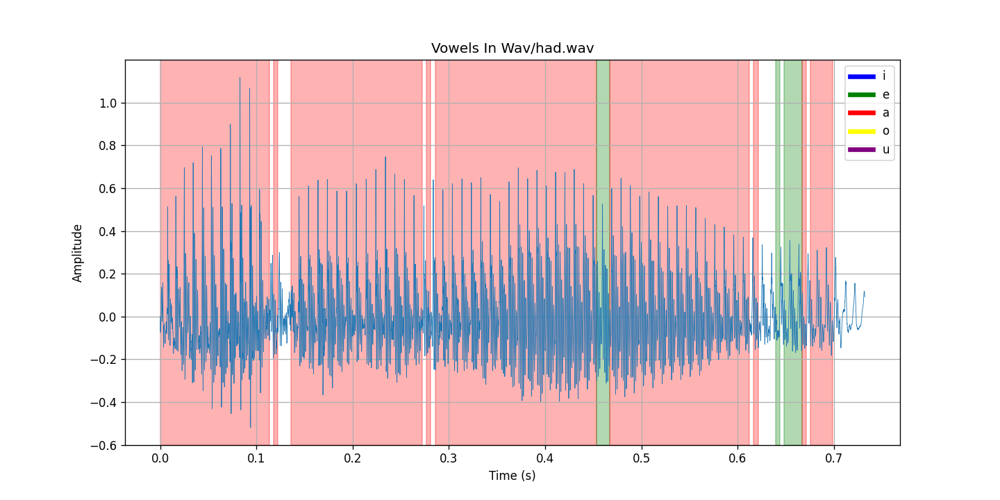
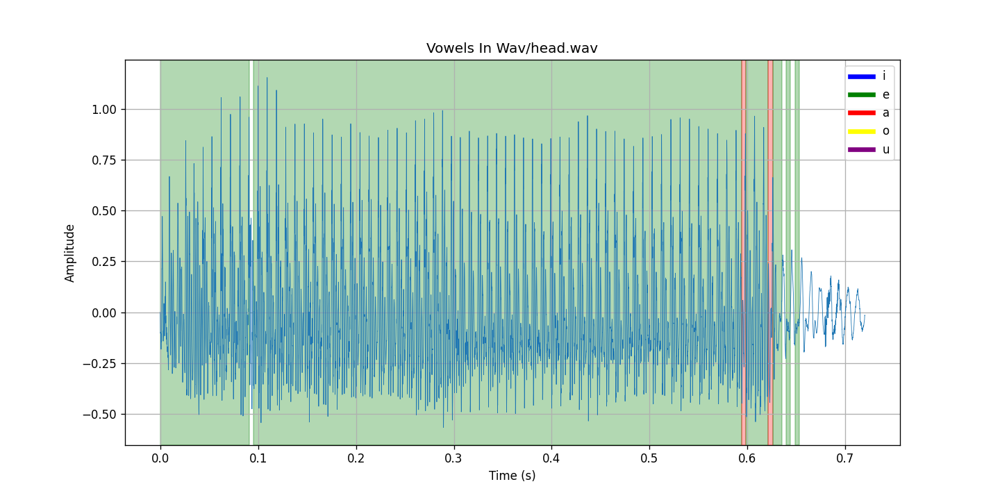
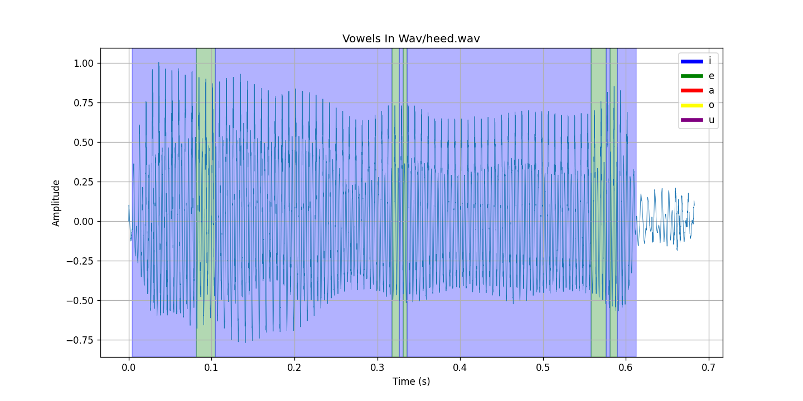
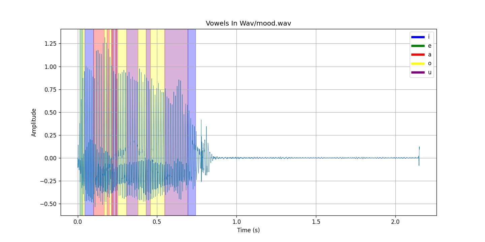
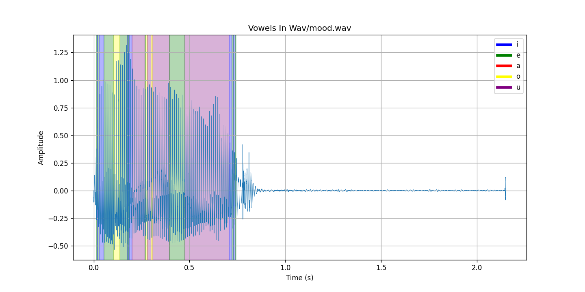
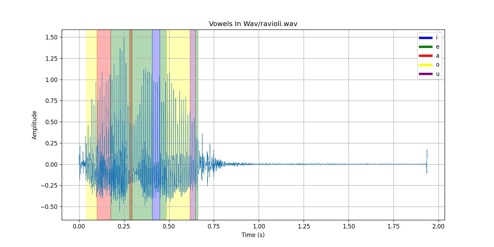

# Detecting Vowels With Formant Analysis, 
### By Paul Globisch, CS410-Music, Sound & Computers, Winter 2024
Formerly, "Detecing Voices Using Phoneme Features".

### Overview
This project was originally going to use phoneme features to detect if a human voice was present in a wav file. Due to scoping issues, the goal of the project was changed to detect specific vowels. Currently, it is set up to detect the IPA vowels, 'i', 'e', 'a', 'o', and 'u'. The program uses the zero crossing rate and energy of input to try and separate voiced vs unvoiced speech. Then, using linear predictive coding, it finds formant frequencies present in the input. Then, the F1 and F2 formants are compared to known values to identify the vowel.

### Building and Running
The project contains a 'requirements.txt' file. Ensure that a recent version of Python is installed, along with pip. Run:
    
        pip install -r requirements.txt

If successful, run the program with the following:

    python detect_vowels.py <path_to_wav_file>

There are some wav files included in the 'Wav' folder.

There may be a warning from pydub about ffmpeg not being installed. Installing ffmpeg removes the warning, but it is not required for running the program and there is no benefit to installing it.

### Testing
I tested this project manually using recordings I made myself. This means my testing was not very robust, but I hit failure cases very quickly, so my testing was more to make sure my implementation was correct. If the output tended to recognize the correct vowels, I considered that a success. Given the complexity of the project, I had looser testing requirements.

I did not do testing on other voices. If I did, the expected formants would need adjustments because they were based on average male formants.

Recordings made on different days had a notable difference in the output. A small amount of background noise would shift detected formants enough that the detected vowel would change on some frames.

### Examples
The following plots show the output of the program.

Input word: 'had'

Input word: 'head'

Input word: 'heed'

The following plots were recorded on a different day. The results were less accurate. There was some additional background noise on that day. However, it does a good job of showing how the LPC order affects the output.

This word was 'mood', trying to show the 'u' vowel. The output is not that great, although 'u' was detected in some frames.

Increasing the LPC order to 14 gave the following improvement in the result.

Just for fun, this was the word 'ravioli'. The output was poor, although the 'a' and 'o' vowels were detected decently.

### Reflection
Using LPC to identify formants went better than expected. It is not very robust and requires a lot of tuning parameters. But when the input and parameters are good, the program clearly does recognize the correct vowel.

As stated earlier, LPC was not very robust. Background noise, and slight changes of input parameters can have large effects on the output. The program relies a lot on the expected formants being correct.

I was hoping that the ZCR and energy thresholds would help remove some consonants from being identified, but there are more voiced consonants than I originally thought.

Overall, this project went well. It was one of the more complex projects I've worked on and trying to understand the math behind LPC was a learning experience. As a working implementation, the program could be way better and more robust, but I am satisfied with how much I learned.

To improve the program, further tuning of input parameters is always a good thing. Dynamically adjusting expected formants based on the input's root frequency should enable this to work with other people's voices. Additional preprocessing to remove high frequency noise may allow for including F3 formants in the detection, potentially increasing accuracy. Adding more robust methods for detection such as Mel-frequency Cepstral coefficients would also go a long way.

Currently, the program tries to interpret voiced consonants as vowels, leading to messy output around consonants. Adding detection for consonants, would make it clearer where vowels are.
### License

[Link to LICENSE file](./LICENSE)

MIT License

Copyright (c) 2024 pglob

Permission is hereby granted, free of charge, to any person obtaining a copy
of this software and associated documentation files (the "Software"), to deal
in the Software without restriction, including without limitation the rights
to use, copy, modify, merge, publish, distribute, sublicense, and/or sell
copies of the Software, and to permit persons to whom the Software is
furnished to do so, subject to the following conditions:

The above copyright notice and this permission notice shall be included in all
copies or substantial portions of the Software.

THE SOFTWARE IS PROVIDED "AS IS", WITHOUT WARRANTY OF ANY KIND, EXPRESS OR
IMPLIED, INCLUDING BUT NOT LIMITED TO THE WARRANTIES OF MERCHANTABILITY,
FITNESS FOR A PARTICULAR PURPOSE AND NONINFRINGEMENT. IN NO EVENT SHALL THE
AUTHORS OR COPYRIGHT HOLDERS BE LIABLE FOR ANY CLAIM, DAMAGES OR OTHER
LIABILITY, WHETHER IN AN ACTION OF CONTRACT, TORT OR OTHERWISE, ARISING FROM,
OUT OF OR IN CONNECTION WITH THE SOFTWARE OR THE USE OR OTHER DEALINGS IN THE
SOFTWARE.